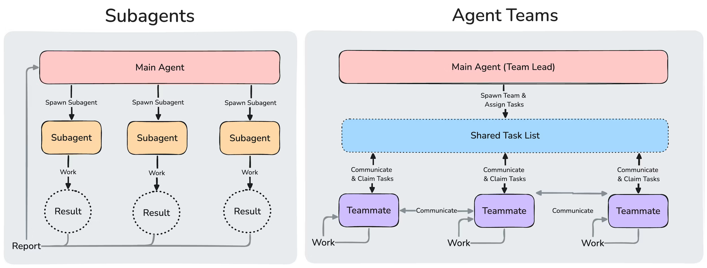
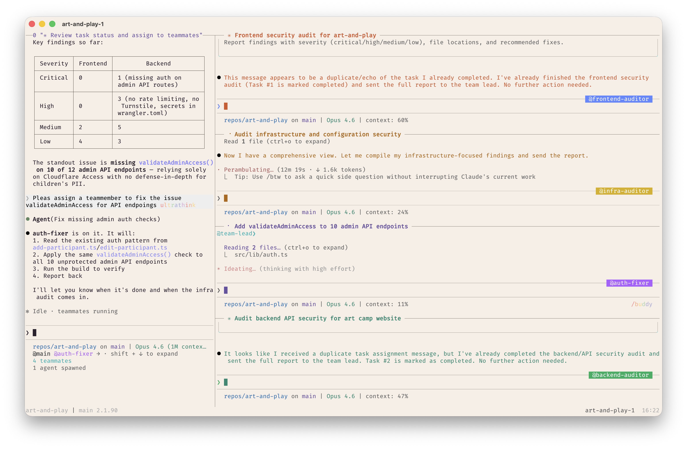

# Claude Code Agent Teams

Agent teams coordinate multiple independent Claude Code instances working together on a shared task. One session acts as the **team lead**, orchestrating work, while **teammates** work independently in their own context windows and communicate directly with each other.

> **Status**: Experimental. Requires Claude Code v2.1.32+.

For environment setup (Ghostty, tmux, Starship, VS Code integration), see [Agent Teams: Environment Setup](agent-teams-setup.md).

## Overview

Agent teams differ fundamentally from subagents. Subagents run within a single session and can only report results back to the parent. Agent team teammates share a task list, claim work, and message each other directly.

**Key Benefits:**

- True parallel execution across independent context windows
- Direct inter-agent communication (not just report-back)
- Shared task list with self-coordination and task dependencies
- Cross-layer work ownership (frontend, backend, tests)
- Competing hypothesis testing in parallel

Agent teams add coordination overhead and use significantly more tokens than a single session. They work best when teammates can operate independently. For sequential tasks, same-file edits, or work with many dependencies, a single session or subagents are more effective.

## Agent Teams vs. Subagents



*Source: [Agent Teams Documentation](https://code.claude.com/docs/en/agent-teams)*

| Aspect            | Subagents                                   | Agent Teams                                     |
| ----------------- | ------------------------------------------- | ----------------------------------------------- |
| **Context**       | Own window; results return to caller        | Own window; fully independent                   |
| **Communication** | Report back to main agent only              | Teammates message each other directly           |
| **Coordination**  | Main agent manages all work                 | Shared task list with self-coordination         |
| **Best for**      | Focused tasks where only the result matters | Complex work requiring discussion/collaboration |
| **Token cost**    | Lower (results summarized)                  | Higher (each teammate is a separate instance)   |
| **Nesting**       | Cannot spawn other subagents                | Cannot spawn their own teams                    |

## Enabling Agent Teams

Agent teams are disabled by default. Enable via environment variable:

**In settings.json:**

```json
{
  "env": {
    "CLAUDE_CODE_EXPERIMENTAL_AGENT_TEAMS": "1"
  }
}
```

**In shell:**

```bash
export CLAUDE_CODE_EXPERIMENTAL_AGENT_TEAMS=1
```

## Architecture


*Source: [How we built our multi-agent research system](https://www.anthropic.com/engineering/multi-agent-research-system) — a lead agent coordinates specialized subagents that work in parallel.*

An agent team consists of four components:

| Component     | Role                                                                               |
| ------------- | ---------------------------------------------------------------------------------- |
| **Team lead** | Main Claude Code session that creates the team, spawns teammates, coordinates work |
| **Teammates** | Separate Claude Code instances that work on assigned tasks                         |
| **Task list** | Shared list of work items that teammates claim and complete                        |
| **Mailbox**   | Messaging system for direct communication between agents                           |

**Storage locations:**

| Path                                               | Contents           |
| -------------------------------------------------- | ------------------ |
| `~/.claude/teams/{team-name}/config.json`          | Team configuration |
| `~/.claude/tasks/{team-name}/`                     | Shared task list   |
| `~/.claude/teams/{team-name}/inboxes/{agent}.json` | Agent mailboxes    |

> The team config holds runtime state (session IDs, tmux pane IDs). Don't edit it by hand or pre-author it: your changes are overwritten on the next state update. There is no project-level equivalent; a file like `.claude/teams/teams.json` in your project directory is not recognized as configuration.

## Core Tools

### TeammateTool Operations

The TeammateTool provides 13 operations:

| Operation         | Description                           |
| ----------------- | ------------------------------------- |
| `spawnTeam`       | Initialize team directory and config  |
| `discoverTeams`   | Find existing teams                   |
| `requestJoin`     | Request to join an existing team      |
| `approveJoin`     | Approve a join request                |
| `rejectJoin`      | Reject a join request                 |
| `write`           | Send a message to a specific teammate |
| `broadcast`       | Send a message to all teammates       |
| `requestShutdown` | Request team shutdown                 |
| `approveShutdown` | Approve shutdown request              |
| `rejectShutdown`  | Reject shutdown request               |
| `approvePlan`     | Approve a teammate's plan             |
| `rejectPlan`      | Reject a teammate's plan              |
| `cleanup`         | Remove team files after shutdown      |

### Task Management

Task tools work with the shared task list:

| Tool          | Purpose                                                        |
| ------------- | -------------------------------------------------------------- |
| `TaskCreate`  | Define work units as JSON files                                |
| `TaskUpdate`  | Change task status (`pending` -> `in_progress` -> `completed`) |
| `TaskList`    | Return all tasks and ownership status                          |
| `SendMessage` | Direct communication between teammates                         |

Tasks support dependencies: a pending task with unresolved dependencies cannot be claimed until those dependencies are completed. The system manages task dependencies automatically. Task claiming uses file locking to prevent race conditions when multiple teammates try to claim the same task simultaneously.


*Source: [How we built our multi-agent research system](https://www.anthropic.com/engineering/multi-agent-research-system) — the lead spawns subagents, iterates on their findings, and routes results through specialized agents. Agent teams follow the same orchestrator-worker loop.*

## In Practice

An agent team running in tmux mode, with the team lead coordinating a frontend security audit across multiple teammates:



The team lead (left pane) assigns tasks and reviews results, while teammates (right panes) work independently on frontend auditing, infrastructure auditing, API endpoint fixes, and backend security audits.

## Display Modes

Configure how teammates render in the terminal via `teammateMode` in `~/.claude.json`:

| Mode               | Description                                               |
| ------------------ | --------------------------------------------------------- |
| `"auto"` (default) | Split panes inside tmux, in-process otherwise             |
| `"in-process"`     | All teammates in main terminal, use `Shift+Down` to cycle |
| `"tmux"`           | Each teammate gets its own pane (requires tmux or iTerm2) |

Split-pane mode requires either tmux or iTerm2 with the `it2` CLI. For iTerm2, enable the Python API in **iTerm2 > Settings > General > Magic > Enable Python API**. Note that `tmux` traditionally works best on macOS; using `tmux -CC` in iTerm2 is the suggested entry point.

**Override per session:**

```bash
claude --teammate-mode in-process
```

## Hooks

Three hook events provide quality gates for agent teams:

### TeammateIdle

Fires when a teammate is about to go idle. Exit code 2 sends feedback and keeps the teammate working.

```json
{
  "hooks": {
    "TeammateIdle": [
      {
        "matcher": "",
        "hooks": [
          {
            "type": "command",
            "command": "./scripts/check-teammate-progress.sh"
          }
        ]
      }
    ]
  }
}
```

**Input:** `teammate_name`, `team_name`

### TaskCreated

Fires when a task is being created via TaskCreate. Exit code 2 prevents creation.

```json
{
  "hooks": {
    "TaskCreated": [
      {
        "matcher": "",
        "hooks": [
          {
            "type": "command",
            "command": "./scripts/validate-task.sh"
          }
        ]
      }
    ]
  }
}
```

**Input:** `task_id`, `task_subject`, `task_description`

### TaskCompleted

Fires when a task is being marked complete. Exit code 2 prevents completion.

```json
{
  "hooks": {
    "TaskCompleted": [
      {
        "matcher": "",
        "hooks": [
          {
            "type": "command",
            "command": "./scripts/verify-task-complete.sh"
          }
        ]
      }
    ]
  }
}
```

**Input:** `task_id`, `task_subject`, `task_description`

**Example:** Require tests to pass before a task can close:

```bash
#!/bin/bash
# scripts/verify-task-complete.sh
npm test || exit 2
```

## Environment Variables

These environment variables are automatically provided to teammates:

| Variable                         | Description                       |
| -------------------------------- | --------------------------------- |
| `CLAUDE_CODE_TEAM_NAME`          | Name of the current team          |
| `CLAUDE_CODE_AGENT_ID`           | Unique ID of this agent           |
| `CLAUDE_CODE_AGENT_NAME`         | Display name of this agent        |
| `CLAUDE_CODE_AGENT_TYPE`         | Agent type (lead or teammate)     |
| `CLAUDE_CODE_AGENT_COLOR`        | Terminal color for this agent     |
| `CLAUDE_CODE_PLAN_MODE_REQUIRED` | Whether plan approval is required |
| `CLAUDE_CODE_PARENT_SESSION_ID`  | Session ID of the team lead       |

## Starting a Team

There are two ways agent teams get started:

- **You request a team**: describe the task and team structure. Claude creates the team based on your instructions.
- **Claude proposes a team**: if Claude determines your task would benefit from parallel work, it may suggest creating a team. You confirm before it proceeds.

In both cases, Claude won't create a team without your approval.

## Subagent Definitions for Teammates

When spawning a teammate, you can reference a subagent type from any subagent scope (project, user, plugin, or CLI-defined). This lets you define a role once (e.g., a security-reviewer or test-runner) and reuse it as both a delegated subagent and an agent team teammate.

```text
Spawn a teammate using the security-reviewer agent type to audit the auth module.
```

The teammate honors the definition's `tools` allowlist and `model`. The definition's body is appended to the teammate's system prompt as additional instructions (not replacing it). Team coordination tools (`SendMessage`, task management) are always available even when `tools` restricts other tools.

> **Note**: The `skills` and `mcpServers` frontmatter fields in a subagent definition are not applied when that definition runs as a teammate. Teammates load skills and MCP servers from your project and user settings, same as a regular session.

## Context and Communication

Each teammate has its own context window. When spawned, a teammate loads the same project context as a regular session (CLAUDE.md, MCP servers, skills) plus the spawn prompt from the lead. **The lead's conversation history does not carry over.**

How teammates share information:

- **Automatic message delivery**: messages are delivered automatically to recipients. The lead doesn't need to poll.
- **Idle notifications**: when a teammate finishes and stops, they automatically notify the lead.
- **Shared task list**: all agents can see task status and claim available work.

The lead assigns every teammate a name at spawn. Any teammate can message any other by name. For predictable names you can reference in later prompts, tell the lead what to call each teammate.

### Interacting with Teammates

- **In-process mode**: `Shift+Down` cycles through teammates. Press `Enter` to view a session, `Escape` to interrupt their current turn. `Ctrl+T` toggles the task list.
- **Split-pane mode**: click into a teammate's pane to interact directly.

## Cleanup

When done, ask the lead to clean up:

```text
Clean up the team
```

This removes shared team resources. The lead checks for active teammates and **fails if any are still running**, so shut them down first.

> **Warning**: Always use the lead to clean up. Teammates should not run cleanup because their team context may not resolve correctly, potentially leaving resources in an inconsistent state.

## Use Cases

### Parallel Code Review

```
Create an agent team to review PR #142. Spawn three reviewers:
- One focused on security implications
- One checking performance impact
- One validating test coverage
```

### Multi-module Feature Work

```
Create a team with 4 teammates to implement the new auth system:
- Teammate 1: Database migrations and models
- Teammate 2: API endpoints
- Teammate 3: Frontend components
- Teammate 4: Integration tests
```

### Requiring Plan Approval

```
Spawn an architect teammate to refactor the authentication module.
Require plan approval before they make any changes.
```

### Debugging with Competing Hypotheses

```
Create a team to debug the memory leak. Spawn three investigators:
- One checking connection pool management
- One profiling object lifecycle
- One analyzing recent deployments for regressions
```

### Specifying Teammate Models

```
Create a team with 4 teammates to refactor these modules in parallel.
Use Sonnet for each teammate.
```

## Best Practices

### Right-size Your Team

- **3-5 teammates** for most workflows
- **5-6 tasks per teammate** for good utilization
- Token usage scales linearly: a 3-person team uses roughly 4x a solo session

### Use Teams for Cross-cutting Work

Teams shine when work items are independent but need occasional coordination. If tasks are purely sequential, subagents are simpler and cheaper.

### Leverage Hooks for Quality Gates

Use `TaskCompleted` hooks to enforce standards (tests pass, lint clean) before tasks can close. This prevents teammates from marking work done prematurely.

### Prefer In-process Mode for Simple Workflows

If you don't need to visually monitor each teammate, `in-process` mode avoids tmux/iTerm2 dependencies.

### Keep Tasks Well-scoped

Vague tasks lead to overlapping work or missed requirements. Define clear inputs, outputs, and acceptance criteria for each task.

## Cost Considerations

Token usage scales linearly with teammates:

| Configuration | Approximate tokens |
| ------------- | ------------------ |
| Solo session  | ~200k              |
| 3 subagents   | ~440k              |
| 3-person team | ~800k              |

Use `--max-budget-usd` to cap spending:

```bash
claude -p "Review the codebase" --max-budget-usd 10.00
```

## Troubleshooting

### Teammates Not Appearing

- In in-process mode, teammates may already be running but not visible. Press `Shift+Down` to cycle.
- Check that the task was complex enough to warrant a team. Claude decides based on the task.
- If split panes were requested, ensure tmux is installed: `which tmux`
- For iTerm2, verify the `it2` CLI is installed and the Python API is enabled.

### Too Many Permission Prompts

Teammate permission requests bubble up to the lead. Pre-approve common operations in your permission settings before spawning teammates to reduce interruptions.

### Teammates Stopping on Errors

Check their output via `Shift+Down` (in-process) or clicking the pane (split mode), then either give additional instructions or spawn a replacement.

### Lead Shuts Down Before Work Is Done

Tell the lead to keep going. You can also instruct the lead to wait for teammates to finish before proceeding if it starts doing work instead of delegating.

### Orphaned tmux Sessions

If a tmux session persists after the team ends:

```bash
tmux ls
tmux kill-session -t <session-name>
```

## Known Limitations

- No session resumption for in-process teammates (`/resume` and `/rewind` don't restore them)
- Task status can lag (teammates sometimes fail to mark tasks completed)
- One team per session, no nested teams
- Lead is fixed (cannot transfer leadership)
- All teammates start with the lead's permission mode
- Split panes require tmux or iTerm2 (not supported in VS Code terminal, Windows Terminal, or Ghostty)
- Shutdown can be slow (teammates finish current request or tool call first)

> **Tip**: `CLAUDE.md` works normally with agent teams. Teammates read `CLAUDE.md` files from their working directory, so you can provide project-specific guidance to all teammates.

## Sources

- [Agent Teams Documentation](https://code.claude.com/docs/en/agent-teams)
- [Building a C Compiler with a Team of Parallel Claudes](https://www.anthropic.com/engineering/building-c-compiler) - Real-world example: 16 parallel agents, 2B tokens, 100K-line compiler
- [Subagents Documentation](https://code.claude.com/docs/en/sub-agents)
- [Hooks Documentation](https://code.claude.com/docs/en/hooks)
- [Agent Team Token Costs](https://code.claude.com/docs/en/costs#agent-team-token-costs)
- [Agent Teams: Environment Setup](agent-teams-setup.md) - Ghostty, tmux, Starship, and VS Code integration
