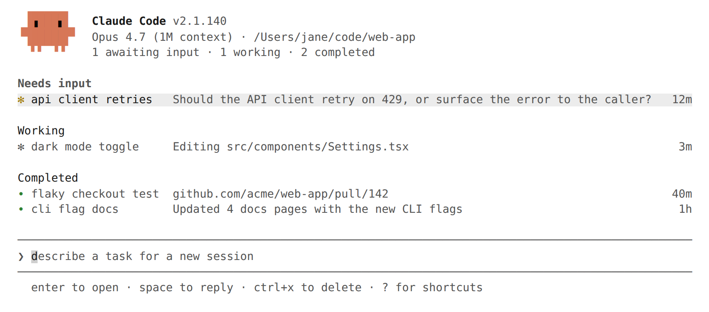

# Agent View

Agent view is a terminal dashboard for managing multiple Claude Code background sessions from one screen. Instead of juggling terminal tabs or tmux grids, agent view groups all sessions by state, shows one-line summaries and PR status, and lets users peek at output, reply to questions, or attach to any session — without losing context.

> **Status**: Research Preview. Requires Claude Code v2.1.139+.



## Overview

Agent view replaces the workflow of manually managing parallel Claude Code sessions. It provides:

- **Unified session list** showing every background session across all projects
- **State grouping** so sessions needing attention sort to the top
- **Peek and reply** to answer questions without leaving the dashboard
- **PR status indicators** visible at a glance on each session row
- **Auto-generated summaries** describing what each session is doing
- **File isolation** via automatic git worktrees for safe parallel edits

Agent view complements [agent teams](./agent-teams.md) and [subagents](./agents.md). Agent teams share a task list and communicate directly. Subagents run within a single session and report results. Agent view operates at a higher level — it manages independent background sessions that may or may not be part of a team.

## Opening Agent View

There are two ways to open agent view:

| Method           | Description                                         |
| ---------------- | --------------------------------------------------- |
| `claude agents`  | Launch from the shell                               |
| `←` (left arrow) | Press on an empty prompt in any Claude Code session |

The left-arrow shortcut works from any session — not just ones dispatched from agent view. It backgrounds the current session and opens the dashboard. Disable this shortcut in `/config` if it conflicts with line editing.

## Session States

Each session row shows an icon indicating its current state and process status.

### Activity state

| State       | Icon     | Description                                               |
| ----------- | -------- | --------------------------------------------------------- |
| Working     | Animated | Claude is actively running tools or generating a response |
| Needs input | Yellow   | Waiting for a user answer or permission decision          |
| Idle        | Dimmed   | Ready for the next prompt                                 |
| Completed   | Green    | Task finished successfully                                |
| Failed      | Red      | Task ended with an error                                  |
| Stopped     | Grey     | Stopped with `Ctrl+X` or `claude stop`                    |

### Process status

| Icon                 | Meaning                                                  |
| -------------------- | -------------------------------------------------------- |
| `✻` / `✽` (animated) | Process alive, replies immediately                       |
| `∙`                  | Process exited, restarts on interaction                  |
| `✢`                  | `/loop` session sleeping (shows run count and countdown) |

## Row Display

### Auto-generated summaries

Each session row includes a one-line summary generated by a Haiku-class model. Summaries refresh at most once every 15 seconds while a session is working, plus once when a turn ends. Each refresh is one short Haiku request billed under the user's normal provider terms.

### PR status

When a session opens a pull request, a status dot appears on the row:

| Dot color | Meaning                                             |
| --------- | --------------------------------------------------- |
| Yellow    | Checks running, checks failed, or waiting on review |
| Green     | Checks passed, no blocking review                   |
| Purple    | Merged                                              |
| Grey      | Draft or closed                                     |

In terminals that support hyperlinks, the dot links directly to the PR. If a session opens multiple PRs, the row shows a count and the dot color reflects the most urgent status.

### Grouping

Toggle grouping mode with `Ctrl+S`:

- **By state** (default): Sessions grouped under Needs input, Ready for review, Working, Completed
- **By directory**: Sessions grouped by working directory

Completed sessions fold into a collapsed `… N more` row. Sessions with failures or open PRs remain visible.

## Interacting with Sessions

### Peek and reply

Press `Space` on any session row to open the peek panel. It shows the most recent output or question — not the full transcript. From the peek panel:

| Action                          | How                                |
| ------------------------------- | ---------------------------------- |
| Reply to a question             | Type an answer and press `Enter`   |
| Select a multiple-choice option | Press the corresponding number key |
| Apply suggested reply           | Press `Tab`                        |
| Run a shell command             | Prefix with `!`                    |
| Peek adjacent sessions          | `↑` / `↓`                          |
| Attach to session               | `→`                                |
| Close peek                      | `Esc`                              |

### Attach and detach

Press `Enter` or `→` on a row to attach. Agent view is replaced by the full interactive session. Claude posts a summary of what happened while the user was away.

To detach and return to agent view:

| Method                      | Behavior                                    |
| --------------------------- | ------------------------------------------- |
| `←` on empty prompt         | Return to agent view; session keeps running |
| `Ctrl+Z`                    | Immediate detach                            |
| `Ctrl+C`, `Ctrl+D`, `/exit` | Leave session running in background         |
| `/stop`                     | End the session                             |

## Dispatching Sessions

### From agent view

Type a prompt in the bottom input and press `Enter`. Each prompt starts a new session — it is not a follow-up to an existing one. The session is named automatically from the prompt (rename with `Ctrl+R`). Images can be pasted into the dispatch input.

**Dispatch modifiers:**

| Modifier                | Effect                                    |
| ----------------------- | ----------------------------------------- |
| `<agent-name> <prompt>` | Run a custom subagent as the main agent   |
| `@<agent-name>`         | Mention a subagent anywhere in the prompt |
| `@<repo>`               | Run the session in a specific repository  |
| `/<skill>`              | Dispatch a skill as a workflow            |
| `#<number>` or PR URL   | Select the existing session for that PR   |
| `Shift+Enter`           | Dispatch and immediately attach           |

### From inside a session

| Command                | Effect                                         |
| ---------------------- | ---------------------------------------------- |
| `/background` or `/bg` | Move the current session to background         |
| `/bg <prompt>`         | Give one more instruction before backgrounding |

Running subagents and background commands do not transfer when backgrounding a session.

### From the shell

```bash
# Dispatch to background
claude --bg "refactor the auth module"

# Dispatch with a specific subagent
claude --agent security-reviewer --bg "audit the login flow"
```

Both forms print the session ID and management commands after dispatching.

## File Isolation

Before editing files, a background session automatically moves to an isolated git worktree under `.claude/worktrees/`. Parallel sessions read the same checkout but write to their own worktrees, preventing conflicts.

**Worktree creation is skipped when:**

- The session is already under `.claude/worktrees/`
- The working directory is not a git repository
- Writes target a path outside the working directory

In non-git repositories, sessions write directly to the working directory. Avoid parallel edits in this case.

**Cleanup:** A worktree is removed when its session is deleted. Always commit and push changes before deleting a session that edited files.

## Organization and Filtering

### Organization shortcuts

| Shortcut                 | Action                                               |
| ------------------------ | ---------------------------------------------------- |
| `Ctrl+S`                 | Toggle grouping (state vs directory)                 |
| `Ctrl+T`                 | Pin/unpin session (pinned sessions sort to top)      |
| `Shift+↑` / `Shift+↓`    | Reorder sessions                                     |
| `Ctrl+R`                 | Rename session                                       |
| `Enter` on group header  | Collapse/expand group                                |
| `Ctrl+X`                 | Stop session; press again within 2 seconds to delete |
| `Ctrl+X` on group header | Delete all sessions in group (with confirmation)     |

### Filtering

Type a filter expression in the dispatch input:

| Filter                | Matches                                                    |
| --------------------- | ---------------------------------------------------------- |
| `a:<name>`            | Sessions running a named agent                             |
| `s:<state>`           | Sessions in a given state (e.g., `s:working`, `s:blocked`) |
| `#<number>` or PR URL | Session working on that PR                                 |

## Keyboard Shortcuts

| Shortcut              | Action                                                   |
| --------------------- | -------------------------------------------------------- |
| `↑` / `↓`             | Move between rows                                        |
| `Enter`               | Attach to selected session, or dispatch if text in input |
| `Space`               | Open/close peek panel                                    |
| `Shift+Enter`         | Dispatch and attach immediately                          |
| `→`                   | Attach to selected session                               |
| `Alt+1` .. `Alt+9`    | Attach to session 1–9 in current group                   |
| `Tab`                 | Browse subagents (empty input) or apply suggestion       |
| `Ctrl+S`              | Switch grouping (state vs directory)                     |
| `Ctrl+T`              | Pin/unpin selected session                               |
| `Ctrl+R`              | Rename selected session                                  |
| `Ctrl+G`              | Open dispatch prompt in `$EDITOR`                        |
| `Ctrl+X`              | Stop session; press twice to delete                      |
| `Shift+↑` / `Shift+↓` | Reorder selected session                                 |
| `Esc`                 | Close peek panel, clear input, or exit                   |
| `Ctrl+C`              | Clear input; press twice to exit                         |
| `?`                   | Show all shortcuts                                       |

## Shell Management Commands

Manage sessions from the shell without opening agent view:

| Command                | Description                                        |
| ---------------------- | -------------------------------------------------- |
| `claude agents`        | Open agent view                                    |
| `claude attach <id>`   | Attach to a session in the terminal                |
| `claude logs <id>`     | Print recent output                                |
| `claude stop <id>`     | Stop a session (alias: `claude kill`)              |
| `claude respawn <id>`  | Restart a stopped session with conversation intact |
| `claude respawn --all` | Restart all stopped sessions                       |
| `claude rm <id>`       | Remove session from list and clean up worktree     |

## Background Session Architecture

### Supervisor process

A per-user daemon hosts all background sessions. It starts automatically on first use of agent view or any background dispatch.

| Aspect            | Detail                                                                    |
| ----------------- | ------------------------------------------------------------------------- |
| Authentication    | Uses the same credentials as interactive sessions                         |
| Process model     | Each background session is a separate Claude Code process                 |
| Idle cleanup      | Stops a session process after ~1 hour idle and unattached                 |
| State persistence | Transcript and state on disk; a fresh process resumes on next interaction |
| Auto-update       | Watches the binary, restarts after the auto-updater replaces it           |
| Session survival  | Background sessions keep running through supervisor restarts              |

### Storage locations

| Path                             | Contents                                         |
| -------------------------------- | ------------------------------------------------ |
| `~/.claude/daemon.log`           | Supervisor log                                   |
| `~/.claude/daemon/roster.json`   | Running sessions list (reconnects after restart) |
| `~/.claude/jobs/<id>/state.json` | Per-session state for agent view                 |

Override the base path with the `CLAUDE_CONFIG_DIR` environment variable.

## Configuration

### Model

The agent view header shows the default model used for new dispatches. Override per session:

- `--model` flag with `claude --bg`
- `/model` command after attaching
- `model` field in subagent frontmatter

### Permissions

Background sessions read their permission mode from the target directory's settings or the dispatched subagent's frontmatter. The `defaultMode` from settings applies when no mode is specified. `bypassPermissions` and `auto` require prior interactive acceptance.

### Disabling agent view

| Method               | Setting                            |
| -------------------- | ---------------------------------- |
| Settings file        | `disableAgentView: true`           |
| Environment variable | `CLAUDE_CODE_DISABLE_AGENT_VIEW=1` |
| Managed settings     | Enforced by admin                  |

## Use Cases

### Scaling concurrent work

Dispatch several tasks at once — optionally with skills or custom agents — then return to a list of PRs ready for review:

```text
@backend add rate limiting to the /api/upload endpoint
@frontend update the file upload component to show progress
@tests add integration tests for the upload flow
```

### Long-running agents

PR babysitters, dashboard updaters, and `/loop` jobs show their next run time in the session list. Sessions with the `✢` icon display a countdown to the next iteration.

### Quick context switching

Press `←` mid-session to open agent view, start a related task or answer a quick question, then `→` back to the original session. Peek shows the answer as soon as it lands.

### PR tracking dashboard

Scan the PR status dots and peek at titles to see which sessions have produced pull requests, which are waiting on CI, and which have been merged.

## Comparison with Other Parallel Patterns

| Pattern         | Coordination                 | Isolation                 | Best for                                    |
| --------------- | ---------------------------- | ------------------------- | ------------------------------------------- |
| **Agent view**  | None (independent sessions)  | Auto-worktree per session | Scaling parallel tasks, background dispatch |
| **Agent teams** | Shared task list + messaging | Shared working directory  | Cross-cutting work needing collaboration    |
| **Subagents**   | Report back to parent only   | Parent's context          | Focused single tasks within a session       |
| **Worktrees**   | Manual                       | Manual `git worktree add` | Long-lived feature branches                 |

## Troubleshooting

### `claude agents` lists subagents instead of opening agent view

Agent view is unavailable in the current environment or version. Run `claude update` and verify the feature is not disabled via settings or environment variable.

### Agent view opens with no sessions

This is expected on first use. Type a prompt in the bottom input to dispatch the first session.

### "Cannot open agents — N background task(s) running"

The current session has in-flight subagents, workflows, or background commands. The `←` shortcut will not abandon them. Run `/tasks` to see what is running, then `/bg` to confirm abandoning.

### Prompt rejected as too short

The dispatch input expects a task description of 4+ characters to prevent accidental dispatch from stray keystrokes.

### Sessions show failed after waking machine

Background sessions do not survive sleep or shutdown. Attach, peek, or reply to restart, or run `claude respawn --all`.

### Session slow to respond after attaching

The supervisor stopped the process after ~1 hour idle and unattached. A fresh process starts from where it left off. Sessions that were actively working or waiting for input are never stopped this way.

### `.claude/worktrees/` filling up

Worktrees are removed when their session is deleted. If a session ended without cleanup:

```bash
git worktree list
git worktree remove <path>
```

## Known Limitations

- **Rate limits**: Each background session consumes subscription quota independently. Running 10 parallel agents uses 10x the quota.
- **Local only**: Sessions run on the user's machine and stop on sleep or shutdown.
- **Worktree cleanup**: Changes must be committed and pushed before deleting a session that edited files.
- **Research preview**: Keyboard shortcuts and UI may change during the preview period.

## Availability

| Requirement     | Value                                  |
| --------------- | -------------------------------------- |
| Plans           | Pro, Max, Team, Enterprise, Claude API |
| Minimum version | v2.1.139 (May 11, 2026)                |
| Status          | Research Preview                       |

## Sources

- [Manage multiple agents with agent view](https://code.claude.com/docs/en/agent-view) — official documentation
- [Agent view in Claude Code](https://claude.com/blog/agent-view-in-claude-code) — announcement blog post (May 11, 2026)
- [v2.1.139 changelog](https://code.claude.com/docs/en/changelog#2-1-139) — release notes
- [Run agents in parallel](https://code.claude.com/docs/en/agents) — comparison of parallel execution patterns
- [Agent teams](https://code.claude.com/docs/en/agent-teams) — related feature for coordinated multi-agent work
- [Create custom subagents](https://code.claude.com/docs/en/sub-agents) — related feature for delegated tasks
- [Worktrees](https://code.claude.com/docs/en/worktrees) — manual worktree isolation
