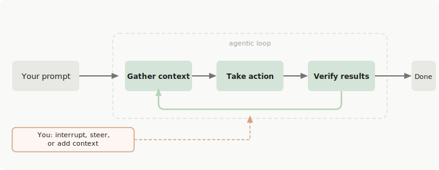

# How Claude Code Works

Claude Code is an agentic assistant that runs in your terminal, IDE, browser, or CI/CD pipeline. While it excels at coding, it can help with anything you can do from the command line: writing docs, running builds, searching files, researching topics, and more.

This doc explains the core architecture: the agentic loop, how Claude gathers context, takes action, verifies its work, and how sessions persist across conversations. If you're new to Claude Code, start here before diving into individual features.

## Overview

Claude Code is an **agentic harness** around the Claude model. A language model on its own can only respond with text. Claude Code wraps the model with tools, context management, and an execution environment, turning it into a capable coding agent that can read your code, edit files, run commands, and iterate toward a goal.

The architecture has two core pieces:

- **Models** that reason and plan (Claude Sonnet, Opus, Haiku)
- **Tools** that act on the world (file operations, shell commands, search, web access)

Everything else (skills, MCP, hooks, subagents) extends these core pieces.

## The Agentic Loop

When you give Claude a task, it works through three phases: **gather context**, **take action**, and **verify results**. These phases blend together. Claude uses tools throughout, whether searching files to understand your code, editing to make changes, or running tests to check its work.



*Diagram source: [Claude Code official docs](https://code.claude.com/docs/en/how-claude-code-works)*

The loop adapts to the task:

- A **question about your codebase** might only need context gathering
- A **bug fix** cycles through all three phases repeatedly
- A **refactor** might involve extensive verification

Claude decides what each step requires based on what it learned from the previous step, chaining dozens of actions together and course-correcting along the way.

**You are part of the loop too.** You can interrupt at any point to steer Claude, add context, or ask it to try a different approach. Claude works autonomously but stays responsive to your input.

## Context Gathering

Claude explores your project the same way a new team member would: by reading code, searching for patterns, and checking conventions before writing anything.

### What Claude Can Access

When you run `claude` in a directory, Claude Code gains access to:

| Source             | What It Is                                                                               |
| ------------------ | ---------------------------------------------------------------------------------------- |
| **Your project**   | Files in your directory and subdirectories, plus files elsewhere with your permission    |
| **Your terminal**  | Any command you could run: build tools, git, package managers, system utilities, scripts |
| **Your git state** | Current branch, uncommitted changes, recent commit history                               |
| **`CLAUDE.md`**    | Project-specific instructions, conventions, and context loaded every session             |
| **Auto memory**    | Learnings Claude saves automatically (first 200 lines or 25KB of `MEMORY.md`)            |
| **Extensions**     | MCP servers, skills, subagents, Claude in Chrome                                         |

Because Claude sees your whole project, it can work across it. When you ask Claude to "fix the authentication bug," it searches for relevant files, reads multiple files to understand context, makes coordinated edits, runs tests to verify the fix, and commits the changes if you ask. This is different from inline code assistants that only see the current file.

### How Claude Explores

Claude typically starts with search and exploration tools:

- **Glob** to find files by pattern (e.g., `src/**/*.ts`)
- **Grep** to search file contents with regex
- **Read** to inspect specific files it identified during search
- **Bash** (git commands) to understand branch state and recent history

For unfamiliar codebases, Claude often reads `CLAUDE.md` first, then scans directory structure, then drills into the specific files relevant to your request.

## Tool Use

Tools are what make Claude Code agentic. Without tools, Claude can only respond with text. With tools, Claude can act: read your code, edit files, run commands, search the web, and interact with external services. Each tool use returns information that feeds back into the loop, informing Claude's next decision.

### Tool Categories

The built-in tools fall into five categories:

| Category              | What Claude Can Do                                                                                                  |
| --------------------- | ------------------------------------------------------------------------------------------------------------------- |
| **File operations**   | Read files, edit code, create new files, rename and reorganize                                                      |
| **Search**            | Find files by pattern, search content with regex, explore codebases                                                 |
| **Execution**         | Run shell commands, start servers, run tests, use git                                                               |
| **Web**               | Search the web, fetch documentation, look up error messages                                                         |
| **Code intelligence** | See type errors and warnings after edits, jump to definitions, find references (requires code intelligence plugins) |

Claude also has tools for spawning subagents, asking you questions, and other orchestration tasks.

### Example: Fixing Failing Tests

When you say "fix the failing tests," Claude might:

1. **Run the test suite** (Bash) to see what's failing
1. **Read the error output** to understand the failure mode
1. **Search for relevant source files** (Grep)
1. **Read those files** (Read) to understand the code
1. **Edit the files** (Edit) to fix the issue
1. **Run the tests again** (Bash) to verify

Each tool use gives Claude new information that informs the next step. This is the agentic loop in action.

### Extending the Base Capabilities

The built-in tools are the foundation. You can extend what Claude knows with:

- [**Skills**](./skills.md) for reusable workflows invoked with `/name`
- [**MCP servers**](./mcp-servers.md) to connect external services (databases, APIs, browsers)
- [**Hooks**](./hooks.md) to run your own scripts at specific points (before a tool call, after an edit)
- [**Subagents**](./agents.md) to offload tasks to agents with fresh context windows

These extensions layer on top of the core agentic loop.

## Verification

Claude checks its own work as it goes. The verification phase is what separates an agent from a model that just writes code.

### How Claude Verifies

- **Running tests** after changes to confirm nothing broke
- **Running linters and type checkers** to catch errors before you do
- **Re-reading edited files** to confirm the change landed correctly
- **Running the build** to make sure the project still compiles
- **Running the program** to see actual behavior vs expected

### Help Claude Verify

Claude performs better when it has something to check against. Include:

- Test cases with inputs and expected outputs
- Screenshots of expected UI
- Explicit success criteria in your prompt

Example:

```text
Implement validateEmail. Test cases:
'user@example.com' → true
'invalid' → false
'user@.com' → false
Run the tests after.
```

When verification fails, Claude returns to the agentic loop: gather more context, try a different action, verify again.

## Session Continuity

Claude Code saves your conversation locally as you work. Each message, tool use, and result is stored, which enables **resuming**, **forking**, and **rewinding** sessions.


*Diagram source: [Claude Code official docs](https://code.claude.com/docs/en/how-claude-code-works)*

### Resume vs Fork

| Mode       | Command                                  | What Happens                                                                                               |
| ---------- | ---------------------------------------- | ---------------------------------------------------------------------------------------------------------- |
| **Resume** | `claude --continue` or `claude --resume` | Pick up where you left off. Same session ID. New messages append to the existing conversation              |
| **Fork**   | `claude --continue --fork-session`       | Create a new session ID preserving conversation history up to that point. Original session stays unchanged |

Resume is for continuing a single line of thought. Fork is for branching off to try a different approach without affecting the original.

In both modes, conversation history is restored but session-scoped permissions are not. You'll need to re-approve those.

### Sessions Are Independent

Each new session starts with a fresh context window. Claude has no memory of previous sessions except through:

- [**Auto memory**](./auto-memory.md): `MEMORY.md` that Claude maintains automatically
- [**CLAUDE.md**](./memory-context.md): instructions you write

Sessions are tied to your current directory. When you resume, you only see sessions from that directory. For parallel work, use [git worktrees](https://code.claude.com/docs/en/common-workflows#run-parallel-claude-code-sessions-with-git-worktrees) or `--fork-session`.

> **Same session in multiple terminals**: Both terminals write to the same session file, and messages get interleaved. Nothing corrupts, but the conversation becomes jumbled. For parallel work from the same starting point, use `--fork-session` to give each terminal its own clean session.

### Rewind with Checkpoints

Before Claude edits any file, it snapshots the current contents. Press `Esc` twice to rewind to a previous state, or ask Claude to undo. See [Checkpointing](./checkpointing.md) for details.

## The Context Window

Claude's context window holds your conversation history, file contents, command outputs, `CLAUDE.md`, auto memory, loaded skills, and system instructions. As you work, context fills up.

When context approaches the limit, Claude Code:

1. **Clears older tool outputs first**
1. **Summarizes the conversation** if needed

Your requests and key code snippets are preserved; detailed instructions from early in the conversation may be lost. Put persistent rules in `CLAUDE.md` rather than relying on conversation history.

Commands to inspect context:

| Command    | What It Shows                                    |
| ---------- | ------------------------------------------------ |
| `/context` | Token usage by category                          |
| `/memory`  | Loaded `CLAUDE.md` files and auto-memory entries |
| `/compact` | Manually compact the conversation                |
| `/mcp`     | Per-server MCP tool costs                        |

[**Skills**](./skills.md) load on demand, and [**subagents**](./agents.md) get their own fresh context. Both help you manage long sessions without bloating the main conversation.

## Execution Environments

The agentic loop, tools, and capabilities are the same everywhere. What changes is where the code executes:

| Environment        | Where Code Runs                         | Use Case                                            |
| ------------------ | --------------------------------------- | --------------------------------------------------- |
| **Local**          | Your machine                            | Default. Full access to your files and environment  |
| **Cloud**          | Anthropic-managed VMs                   | Offload tasks, work on repos you don't have locally |
| **Remote Control** | Your machine, controlled from a browser | Use the web UI while keeping everything local       |

And the interfaces:

- Terminal (CLI)
- Desktop app (Mac/Windows)
- IDE extensions (VS Code, JetBrains)
- Web ([claude.ai/code](https://claude.ai/code))
- Remote Control (mobile/web)
- Slack, GitHub Actions, GitLab CI/CD

## Working Effectively With Claude Code

A few patterns that produce better results:

### Be Specific Upfront

The more precise your initial prompt, the fewer corrections you'll need. Reference specific files, mention constraints, point to example patterns.

```text
The checkout flow is broken for users with expired cards.
Check src/payments/ for the issue, especially token refresh.
Write a failing test first, then fix it.
```

### It's a Conversation

You don't need perfect prompts. Start with what you want, then refine through iteration. If Claude goes down the wrong path, interrupt with a correction and it will adjust.

### Explore Before Implementing

For complex problems, separate research from coding. Use **plan mode** (`Shift+Tab` twice) to analyze first, then implement.

```text
Read src/auth/ and understand how we handle sessions.
Then create a plan for adding OAuth support.
```

### Delegate, Don't Dictate

Give context and direction, then trust Claude to figure out details. You don't need to specify which files to read or what commands to run.

## Sources

- [How Claude Code Works (Official Docs)](https://code.claude.com/docs/en/how-claude-code-works)
- [Explore the Context Window](https://code.claude.com/docs/en/context-window)
- [Common Workflows](https://code.claude.com/docs/en/common-workflows)
- [Tools Reference](https://code.claude.com/docs/en/tools-reference)
- [Features Overview](https://code.claude.com/docs/en/features-overview)
