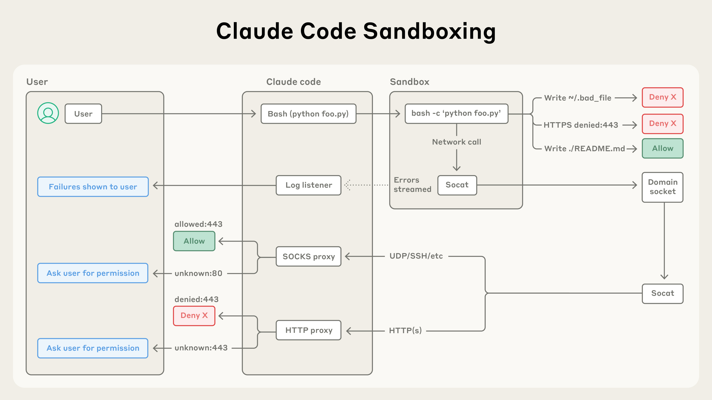
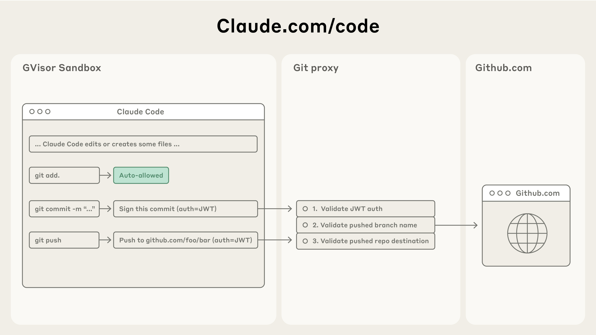

# Claude Code Security and Sandbox

Claude Code features comprehensive security controls including native sandboxing, permission boundaries, and enterprise-grade policy management. In testing, sandboxing achieved an **84% reduction in permission prompts**, addressing approval fatigue and enabling more autonomous workflows.


*Source: [Beyond permission prompts: making Claude Code more secure and autonomous](https://www.anthropic.com/engineering/claude-code-sandboxing)*

## Sandbox Mode

### Overview

Native sandboxing provides filesystem and network isolation while reducing permission prompts. Instead of asking permission for each bash command, sandboxing creates defined boundaries where Claude Code can work more freely with reduced risk. The sandboxed bash tool uses OS-level primitives to enforce both filesystem and network isolation.

### Sandbox Modes

- **Auto-allow mode**: Bash commands execute within sandbox boundaries without permission prompts
- **Regular permissions mode**: All bash commands require explicit approval

### Enabling Sandboxing

```bash
/sandbox  # Interactive menu
```

Or configure in `settings.json`:

```json
{
  "sandbox": {
    "enabled": true,
    "autoAllowBashIfSandboxed": true
  }
}
```

### Platform Support

| Platform | Support          | Notes                                                               |
| -------- | ---------------- | ------------------------------------------------------------------- |
| macOS    | ✅ Native        | Uses Seatbelt framework                                             |
| Linux    | ✅ Supported     | Requires `bubblewrap` and `socat`                                   |
| WSL2     | ✅ Supported     | Uses bubblewrap                                                     |
| WSL1     | ❌ Not supported | Missing kernel features (bubblewrap requires WSL2)                  |
| Windows  | 🔄 Planned       | Check [docs](https://code.claude.com/docs/en/sandboxing) for status |

> **Note**: Platform support evolves. Check the [official sandbox documentation](https://code.claude.com/docs/en/sandboxing) for the latest status.

If the sandbox cannot start (missing dependencies, unsupported platform), Claude Code shows a warning and runs commands without sandboxing. To make this a hard failure instead, set `sandbox.failIfUnavailable` to `true` in your settings. This is intended for managed deployments that require sandboxing as a security gate.

## Network Isolation

Network access is controlled through a proxy server running outside the sandbox. This ensures restrictions apply to all scripts, programs, and subprocesses spawned by commands.


*Source: [Beyond permission prompts: making Claude Code more secure and autonomous](https://www.anthropic.com/engineering/claude-code-sandboxing)*

### Cloud Environment

Three access levels:

- **Limited** (default): Only allowlisted domains
- **Disabled**: No internet access
- **Full**: Complete internet access

### Default Allowlist

Includes:

- Anthropic services (api.anthropic.com, claude.ai)
- Version control (GitHub, GitLab, Bitbucket)
- Container registries (Docker, GCR, ECR)
- Package managers (npm, PyPI, RubyGems, etc.)
- Cloud platforms (AWS, Azure, GCP)

When Claude Code attempts to access a domain not in the allowlist, the operation is blocked at the OS level and you receive a notification. You can deny the request, allow it once, or permanently update your configuration.

### Configuration

```json
{
  "sandbox": {
    "network": {
      "allowedDomains": ["example.com"],
      "blockedDomains": ["untrusted.com"],
      "httpProxyPort": 8080,
      "socksProxyPort": 8081
    }
  }
}
```

When `allowManagedDomainsOnly` is enabled in managed settings, non-allowed domains are blocked automatically without user prompts.

## File System Restrictions

### Default Behavior

- **Write access**: Current working directory and subdirectories only
- **Read access**: Entire computer except denied directories
- **Boundary**: Cannot modify parent directories without permission

### Extending Access

```bash
# During session
/add-dir /path/to/directory

# CLI flag
claude --add-dir /path/to/directory
```

### Persistent Configuration

```json
{
  "permissions": {
    "additionalDirectories": ["../docs/", "/shared/resources"]
  }
}
```

### Subprocess Write Access

If subprocess commands like `kubectl`, `terraform`, or `npm` need to write outside the project directory:

```json
{
  "sandbox": {
    "enabled": true,
    "filesystem": {
      "allowWrite": ["~/.kube", "/tmp/build"]
    }
  }
}
```

Path prefixes:

| Prefix            | Meaning                                                                    |
| ----------------- | -------------------------------------------------------------------------- |
| `/`               | Absolute path from filesystem root                                         |
| `~/`              | Relative to home directory                                                 |
| `./` or no prefix | Relative to project root (project settings) or `~/.claude` (user settings) |

When `allowWrite`, `denyWrite`, `denyRead`, or `allowRead` is defined in multiple settings scopes, the arrays are **merged** (not replaced).

### Blocked Directories

Cannot modify by default:

- `/bin/`, system binaries
- `.bashrc`, `.zshrc`
- Critical system files

### Escape Hatch

When a command fails due to sandbox restrictions, Claude Code may retry with the `dangerouslyDisableSandbox` parameter. Commands using this parameter go through the normal permissions flow requiring user approval.

To disable this escape hatch entirely:

```json
{
  "sandbox": {
    "allowUnsandboxedCommands": false
  }
}
```

When disabled, all commands must run sandboxed or be explicitly listed in `excludedCommands`.

## Permission System

### Permission Modes

| Mode                | Description                     |
| ------------------- | ------------------------------- |
| `default`           | Prompts on first use            |
| `acceptEdits`       | Auto-accepts file edits         |
| `plan`              | Read-only analysis only         |
| `dontAsk`           | Auto-denies unless pre-approved |
| `auto`              | AI-classified safety checks     |
| `bypassPermissions` | Skips all prompts               |

> For comprehensive documentation on auto mode, including classifier architecture, configuration, and threat model, see [Auto Mode](./auto-mode.md).

### Permission Rules

```json
{
  "permissions": {
    "allow": [
      "Bash(npm run:*)",
      "Read(./src/**)",
      "WebFetch(domain:github.com)"
    ],
    "ask": [
      "Bash(git push:*)"
    ],
    "deny": [
      "Bash(rm -rf:*)",
      "Read(.env)",
      "Read(./secrets/**)"
    ]
  }
}
```

### Rule Evaluation

Order: **deny → ask → allow** (first match wins)

### Tool-Specific Patterns

**Bash** (prefix matching):

```json
"Bash(npm run test:*)"  // Word boundary
"Bash(npm *)"           // Anywhere match
```

**Read/Edit** (gitignore patterns):

```json
"Read(//Users/alice/**)"  // Absolute path
"Read(~/Documents/*.pdf)" // Home directory
"Edit(/src/**/*.ts)"      // Relative to settings
```

**WebFetch** (domain-based):

```json
"WebFetch(domain:example.com)"
```

**MCP** (server and tool):

```json
"mcp__github__*"
"mcp__memory__create_entities"
```

## Enterprise Security Controls

### Managed Settings

System-level policy in `managed-settings.json`:

**Locations**:

- macOS: `/Library/Application Support/ClaudeCode/managed-settings.json`
- Linux: `/etc/claude-code/managed-settings.json`
- Windows: `C:\Program Files\ClaudeCode\managed-settings.json`

### MCP Security Policies

```json
{
  "allowedMcpServers": [
    { "serverName": "github" },
    { "serverUrl": "https://mcp.company.com/*" }
  ],
  "deniedMcpServers": [
    { "serverName": "untrusted-server" }
  ]
}
```

### Settings Precedence

1. Managed settings (highest)
1. Command-line arguments
1. Local project settings
1. Shared project settings
1. User settings (lowest)

## Audit Logging

### OpenTelemetry Metrics

Enable with:

```bash
export CLAUDE_CODE_ENABLE_TELEMETRY=1
```

**Available Metrics**:

- Session counter
- Lines of code counter
- Pull request counter
- Commit counter
- Cost counter
- Token counter
- Active time counter

**Available Events**:

- User prompt events
- Tool result events
- API request events
- API error events

### Custom Attributes

```bash
export OTEL_RESOURCE_ATTRIBUTES="team=frontend,department=engineering"
```

## Safe Mode Operations

### Built-In Protections

1. **Sandboxed bash**: OS-level filesystem and network isolation
1. **Write restriction**: Only current directory by default
1. **Accept Edits mode**: Batch accept edits while maintaining command safety
1. **Command blocklist**: curl, wget blocked by default

### Prompt Injection Protections

- Permission system requiring explicit approval
- Context-aware analysis detecting harmful instructions
- Input sanitization preventing command injection
- Command injection detection with warnings
- Fail-closed matching (unmatched defaults to manual approval)

## Security Limitations

- **Network filtering**: The network proxy restricts domains but does not inspect traffic content. Users are responsible for only allowing trusted domains. Broad domains like `github.com` may allow data exfiltration. Domain fronting may bypass network filtering in some cases.
- **Unix sockets**: The `allowUnixSockets` configuration can grant access to powerful system services (e.g., `/var/run/docker.sock`) that could bypass the sandbox.
- **Filesystem escalation**: Overly broad write permissions to directories containing executables in `$PATH`, system config directories, or shell config files can enable privilege escalation.
- **Linux nested sandbox**: The `enableWeakerNestedSandbox` mode for Docker environments considerably weakens security and should only be used where additional isolation is otherwise enforced.

## What Sandboxing Does Not Cover

The sandbox isolates Bash subprocesses. Other tools have different boundaries:

- **Built-in file tools**: Read, Edit, and Write use the permission system directly rather than running through the sandbox.
- **Computer use**: When Claude controls your screen, it runs on your actual desktop rather than in an isolated environment. Per-app permission prompts gate each application.

## Development Containers

### Security Benefits

- Isolated virtual machines per session
- Custom firewall restricting network
- Enhanced isolation for `--dangerously-skip-permissions`
- Default-deny network policy

### Limitations

- Does not prevent exfiltration of accessible data
- Only use with trusted repositories
- Requires monitoring of Claude activities

## Quick Reference

### Enable Sandboxing

```bash
/sandbox
```

### View Permissions

```bash
/permissions
```

### Add Directory Access

```bash
/add-dir /path/to/directory
```

### Plan Mode (Safe Analysis)

```bash
claude --permission-mode plan
```

### Check Sandbox Status

```json
{
  "sandbox": {
    "enabled": true,
    "autoAllowBashIfSandboxed": true
  }
}
```

## Open Source Sandbox Runtime

The sandbox runtime is available as an open source npm package for use in your own agent projects:

```bash
npx @anthropic-ai/sandbox-runtime <command-to-sandbox>
```

This enables the broader AI agent community to build safer autonomous systems. It can also sandbox other programs, such as MCP servers.

For implementation details and source code, visit the [GitHub repository](https://github.com/anthropic-experimental/sandbox-runtime).

## Sources

- [Official Sandboxing Docs](https://code.claude.com/docs/en/sandboxing)
- [Security Docs](https://code.claude.com/docs/en/security)
- [Beyond permission prompts (Engineering Blog)](https://www.anthropic.com/engineering/claude-code-sandboxing)
- [Identity & Access Management](https://code.claude.com/docs/en/iam)
- [Development Containers](https://code.claude.com/docs/en/devcontainer)
