# Site Architecture

- **Date**: 2026-04-04
- **Status**: Design spec (pre-scaffolding)
- **Future location**: moves to `site/ARCHITECTURE.md` after the Fumadocs site is scaffolded

This document explains how the claude-almanac website is built and served — from markdown source to rendered HTML and content-negotiated markdown responses. It is the canonical reference for contributors understanding the full pipeline.

## Overview

claude-almanac is a **static documentation site** with a thin dynamic edge layer:

- **Source of truth**: markdown files in the repo (`features/`, `guides/`, `case-studies/`)
- **Build tool**: [Fumadocs](https://fumadocs.dev/) (Next.js 15 + Tailwind v4 + MDX)
- **Design system**: shadcn/ui with the `claude-almanac` theme from [tweakcn.com](https://tweakcn.com)
- **Hosting**: Cloudflare Pages at `claude-almanac.sivura.com`
- **Dynamic layer**: one Cloudflare Pages Function for `Accept: text/markdown` content negotiation

## High-level architecture

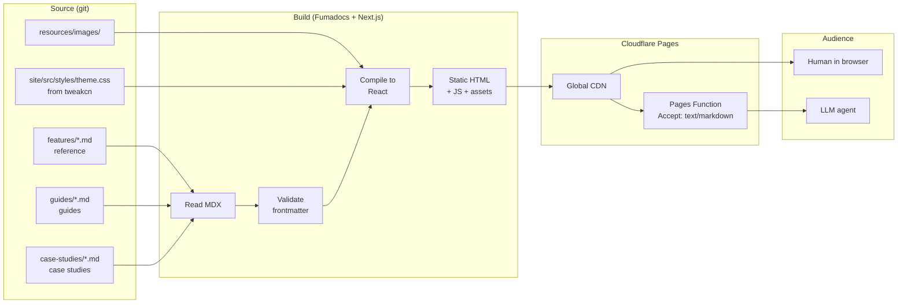

## Source content

Content lives in three directories, each with a distinct content type:

| Directory       | Content type | Frontmatter schema                         | Examples                |
| --------------- | ------------ | ------------------------------------------ | ----------------------- |
| `features/`     | Reference    | title, description, type, category         | hooks, skills, mcp      |
| `guides/`       | Guide        | + time, difficulty, prerequisites, outcome | agent-teams-setup       |
| `case-studies/` | Case study   | + project, date, duration, themes, stack   | building-claude-almanac |

All three feed the **same `/docs/` URL namespace** (slugs must be unique across directories). Source directory is a contributor concept; URL is a reader concept.

See [content-taxonomy.md](./content-taxonomy.md) for the full spec on content types, voices, and schemas.

### Source-to-URL mapping

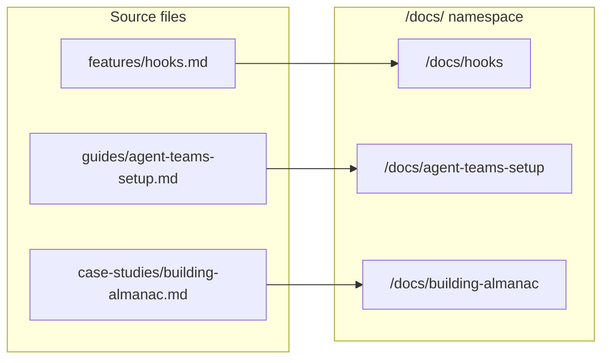

## Build pipeline

When `npm run build` runs in `site/`:

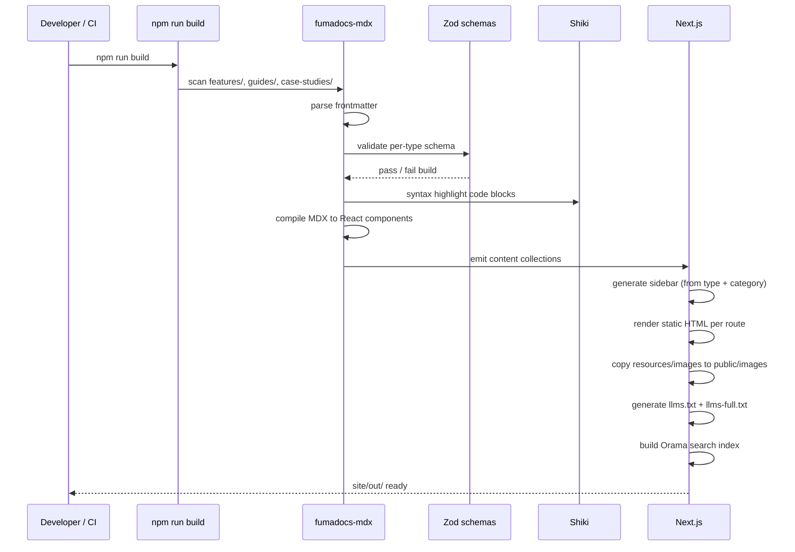

**Build output**: `site/out/` contains static HTML, JS bundles, images, search index, and LLM endpoints.

**Schema validation is strict**: a guide missing the `time` field fails the build. This catches frontmatter drift before deploy.

## Deployment flow

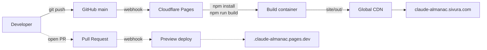

- Push to `main` → auto-deploy to production
- Open PR → preview deployment with unique URL
- Both builds run identical pipelines

## Request flow — HTML (human reader)

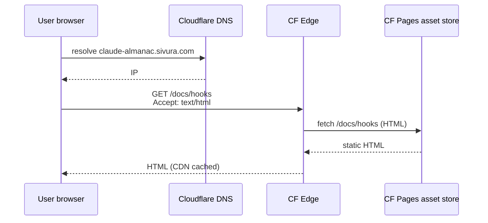

## Request flow — Markdown (LLM agent)

When an agent sends `Accept: text/markdown` (Claude Code and OpenCode do this by default):

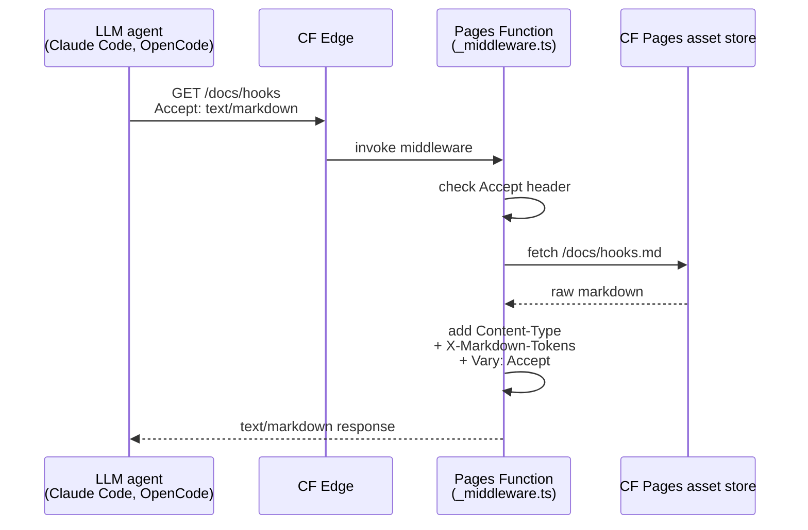

This gives us parity with Cloudflare's paid "Markdown for Agents" feature on the free tier. See [content-negotiation-decision.md](./content-negotiation-decision.md).

## Per-type page rendering

Each content type renders with a distinct layout:

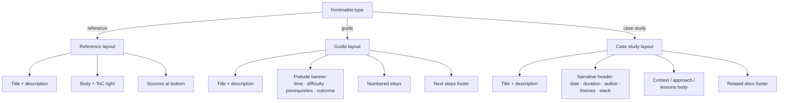

### Reference layout

Standard Fumadocs layout. Content is the focus. ToC auto-generates from headings on the right. "Sources" section at the bottom lists official Anthropic doc links.

### Guide layout

Adds a prelude banner above the content:

```
----------------------------------------------------
  15 min  ·  intermediate  ·  by Alexander
  Prerequisites: macOS · Homebrew · terminal basics
  Outcome: Ghostty + tmux ready for agent teams
----------------------------------------------------
```

Steps are numbered sections. Footer includes "Next steps" linking related guides.

### Case study layout

Adds a narrative header:

```
----------------------------------------------------
  2026-04-04  ·  1 week  ·  by Alexander
  Tags: agent-teams · documentation · fumadocs
  Stack: claude-code · nextjs · cloudflare-pages
----------------------------------------------------
```

Body uses first-person voice. Footer includes "Related case studies" and "Reference docs mentioned".

## Image handling

Images live in `resources/images/` at the repo root (alongside the content). At build time:

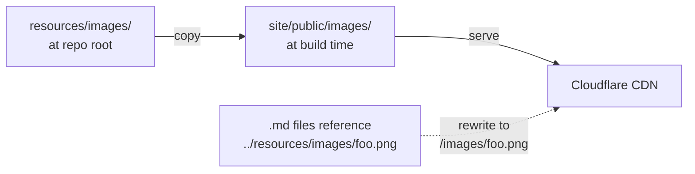

A small build step copies images and rewrites paths so both GitHub rendering and the deployed site work correctly.

## Contributor workflow

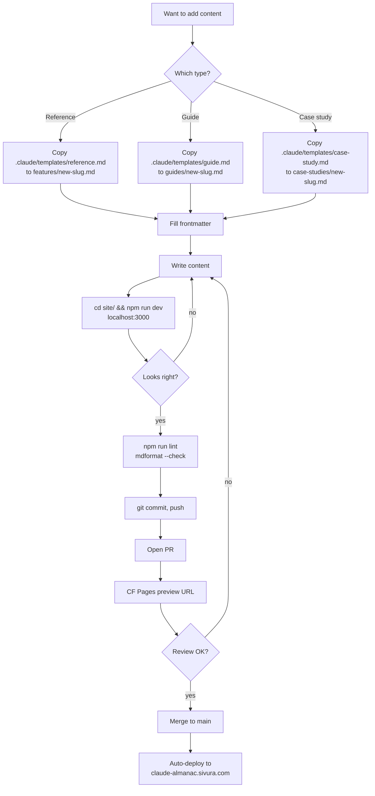

## Theme application

Theme CSS variables flow from tweakcn to every component:

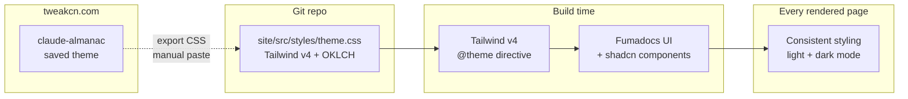

**Source of truth**: tweakcn is the editor; `theme.css` in git is authoritative. Theme changes follow: tweakcn edit → export → paste → commit → PR → deploy.

## Content negotiation: the two access patterns

Readers and agents access the same content through two paths:

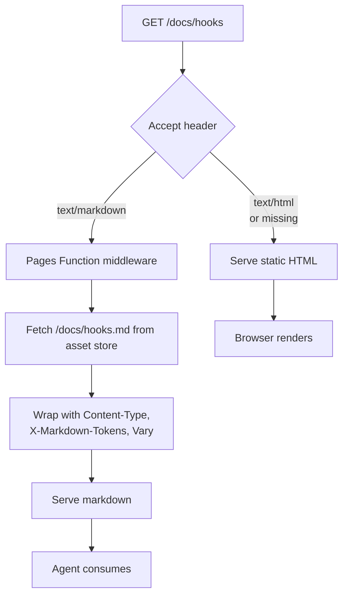

This gives us:

- **URL suffix access**: `/docs/hooks.md` directly serves markdown (static file under the `/docs/` namespace)
- **Accept header negotiation**: `/docs/hooks` with `Accept: text/markdown` serves markdown via Pages Function

Both work simultaneously, no client-side configuration needed.

## LLM endpoints

Generated automatically at build time:

| Endpoint         | Content                                                   |
| ---------------- | --------------------------------------------------------- |
| `/llms.txt`      | Index of all content with links                           |
| `/llms-full.txt` | Full text of all content concatenated                     |
| `/docs/hooks.md` | Per-page markdown endpoint (under the `/docs/` namespace) |

## Performance characteristics

| Metric                     | Target                 |
| -------------------------- | ---------------------- |
| Time to First Byte (TTFB)  | under 100ms (CDN edge) |
| First Contentful Paint     | under 800ms            |
| JS bundle size per page    | under 100kB            |
| Build time                 | under 3 minutes        |
| Lighthouse score (desktop) | 95+                    |

## Related docs

- [framework-decision.md](./framework-decision.md) — why we chose Fumadocs
- [content-negotiation-decision.md](./content-negotiation-decision.md) — why we built our own Accept header middleware
- [content-taxonomy.md](./content-taxonomy.md) — reference vs guide vs case study
- [theme-claude-almanac.css](./theme-claude-almanac.css) — the exported theme

## Open questions

- Should we add a `/changelog` feed tracking content additions?
- Should case studies have their own RSS feed separate from the main feed?
- Do we need search analytics to understand what readers look for?

These can be decided during or after Phase 1 implementation.
